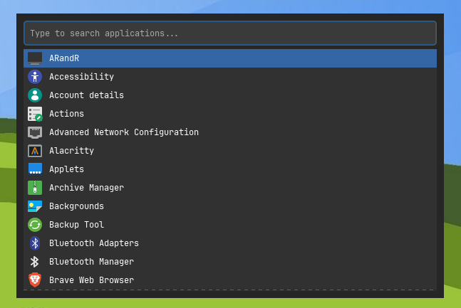

<div align="center">
  
  <h1>Pocket</h1> 
  
  **Pocket** is a lightweight application launcher built with **C++** and **GTK**.  
  It’s designed to be fast, minimal, and integrate natively with different Linux Environments and Window Managers.
</div>

---

## Screenshot

<div align="center">
  
</div>

## Dependencies

Pocket depends on the following packages:

- `g++` (C++17 or newer)
- `make`
- `pkg-config`
- `libgtkmm-3.0-dev` (GTK3 C++ bindings)

### Install them manually

```bash
sudo apt install g++ make pkg-config libgtkmm-3.0-dev
```

## Build and Install

Make sure you have all dependencies installed, then simply run:

```bash
./build.sh
```

This will build `pocket` and install the binary to `/usr/local/bin`. 
You may be prompted for your password during installation.

After installation, you can launch `pocket` from anywhere using:
```bash
pocket
```

Bind `pocket` to a keyboard shortcut in your window manager or desktop environment for quick access.

## Configuration (pocketrc)
Pocket can be customized using a simple configuration file located at:
```bash
~/.config/pocket/pocketrc
```
### Example `pocketrc`
```
font: JetBrainsMono
font-size: 12
icon-theme: Papirus
```

If the configuration file is missing or a value is not specified, Pocket falls back to sensible defaults.

## License

This project is licensed under the [**MIT License**](./LICENSE).
